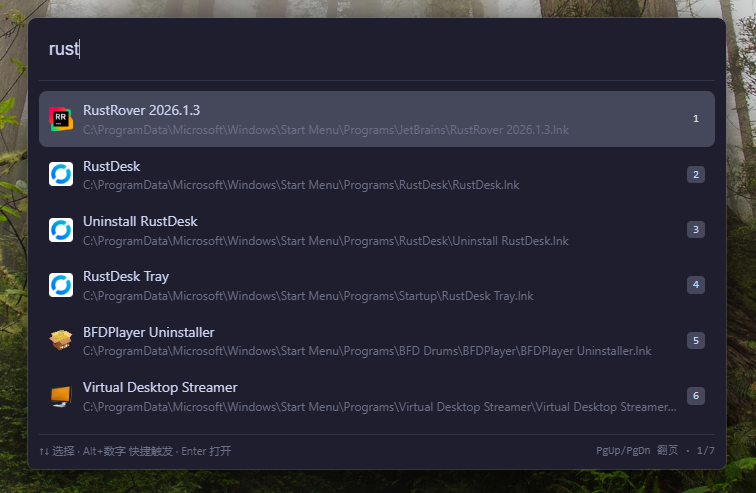

<h1 align="center">Blink</h1>

<p align="center">
  <strong>A Universal Action Layer for Windows — senses what you're doing, makes every action faster than the original path.</strong>
</p>

<p align="center">
  <a href="README.md">English</a> · <a href="README.zh-CN.md">中文</a>
</p>

<p align="center">
  
  
  
  
</p>

<p align="center">
  
</p>

[View the demo GIF](docs/images/blink.gif)

---

## What is Blink

Blink isn't a launcher — it's a **Universal Action Layer**:
search is just one entry point, **action execution is the destination**. By sensing context and proactively suggesting actions, sequences like "select English → translate", "copy URL → open link", "screenshot → clipboard" go from **multiple steps** to **zero input or one Tab**.

- ⚡ **Fast** — Summon &lt; 50ms, first result &lt; 20ms
- 🎯 **Context-aware** — Auto-senses selection / clipboard / foreground app; unobtrusive but always ready
- 🧩 **Extensible** — Sandboxed plugin processes (Rust / Python / Node.js / PowerShell); crashes don't affect core

---

## Features

### Core Search

- **Instant Launch** — `Alt + Space` (customizable, right-Alt tap supported), auto-hide on blur
- **App Search** — Scans Start Menu; fuzzy match + Pinyin initials + full Pinyin (`wx` → 微信, `dksz` → 打开设置)
- **File Search** — Integrates Everything; falls back to local directory scan when Everything is absent
- **Live Calculator** — Type `1+1` or `100*0.25`, press Enter to copy
- **Clipboard History** — Background auto-record + fuzzy search history

### Awareness & Proactive Suggestions (0.8)

- **Selection Awareness** — Grabs selected text in other apps (UIA + mouse hook); one-key translate/search after summoning
- **Ghost Text Autocomplete** — Type `fy hello`, see inline gray `→ fanyi hello`; press Tab to promote to translation
- **Context-Aware Suggestions** — Clipboard is URL / file path → auto-suggest "Open link / Reveal in Explorer"; select English text → Ghost suggestion to translate
- **Weak signals pull, don't push** — Awareness lives on the side channel; adoption = zero disruption, non-adoption = zero cost; each Context trigger can be disabled individually in settings

### Chord Mode (0.8.5 — Alt-hold shortcuts)

Hold Alt while the main window is open; letter keys trigger actions directly:

| Combo | Action |
|---|---|
| `Alt + Q` | Smart selection (floating ball, doesn't steal focus — select text in the origin app, click to confirm, main window restores with text filled) |
| `Alt + C` | Clipboard history top-9 (press Alt+1~9 to quick-pick) |
| `Alt + A` | Region screenshot (area capture → clipboard / save) |

### Plugins & Ecosystem

- **Plugin System** — Isolated processes + JSONL protocol; crashes don't affect core. Runtimes: Rust / Python / Node.js / PowerShell
- **Built-in Plugins** — Translation (Youdao / Baidu / DeepL / Ali / Tencent), Weather, IP lookup
- **Surface Ownership Model** — Trigger and presentation are orthogonal; plugins choose `inline` mixed / `priority` pinned / `takeover` exclusive return area

### Platform & UX

- **Context Menu** — Smart actions by result type (open location, copy path, run as admin, reset ranking, etc.)
- **Themes** — Catppuccin Mocha dark / Latte light / Follow system
- **i18n** — Full 中文 / English bilingual (including plugin content)
- **Configurable** — Hotkeys, engine toggles, auto-start, proxy, log levels, per-item context awareness toggles

---

## Vision · Where We're Heading

Blink is evolving into the **perception & execution layer for local AI** — the reasoning brain is pluggable (any provider / agent), but Blink's moat is what web AI clients can't reach: global context sensing, local action execution, and sub-50ms speed.

- 🧱 **0.9 — Agent Foundation** — Unify builtin / plugin / (future) MCP / skill into one tool model; multi-tier Provider (router / light / main); main-window text loop with AI as a fallback router. Zero voice — text only.
- 🎤 **0.10 — Voice Action Loop** — Dual-chord voice entry (dictation vs command); "find that file I forgot the name of" → Everything search → result back. Architecture unchanged, only adds a sensing layer.
- 🔌 **0.11 — Local & Ecosystem** — On-demand local models / skill-ification / bidirectional MCP / RAG memory.
- 🛡️ **Trust boundary holds** — AI only produces suggestions / tool-call candidates, never executes directly; Tab acceptance is the final human review.

---

## Installation

Download the latest installer from [Releases](../../releases).

---

## Usage

1. Blink sits in the system tray after launch
2. **`Alt + Space`** → summon the input bar
3. Type app name (Pinyin initials/full supported), math expression, or plugin trigger word
4. **↑↓** to navigate, **Enter** or **Alt + 1~9** for quick launch
5. While main window is open, **hold Alt** → Ghost overlay shows Chord shortcuts (Alt+A/Q/C)
6. **Esc** or click outside → hide

### Keyboard Shortcuts

| Action        | Description |
|---------------|---|
| `Alt + Space` | Summon / hide |
| `↑` `↓`       | Navigate results |
| `Alt + 1~9`   | Quick launch by position |
| `Tab`         | Accept Ghost completion (`fy` → `fanyi `) or Context suggestion |
| `Enter`       | Launch / copy result |
| `PgUp` `PgDn` | Page up/down |
| `Alt + C`     | Chord: clipboard history |
| `Alt + A`     | Chord: region screenshot |
| `Esc`         | Hide |

---

## Development

### Prerequisites

- [Rust](https://www.rust-lang.org/tools/install) 1.75+
- [Visual Studio Build Tools](https://visualstudio.microsoft.com/visual-cpp-build-tools/) (MSVC C++ workload)
- [WebView2 Runtime](https://developer.microsoft.com/en-us/microsoft-edge/webview2/) (pre-installed on Windows 10/11)

### Build & Run

```bash
# Dev mode (debug, console logging)
cargo tauri dev

# Release build (includes plugin compilation)
cargo xtask release

# Tests
cargo test --bin blink
```

### Want to modify the core?

Read [`docs/production-design/`](docs/production-design/README.md) first:
- [`00-overview.md`](docs/production-design/00-overview.md) — Product vision + milestones
- [`product-platform.md §5.0`](docs/production-design/product-platform.md) — Four-domain architecture rules
- [`phases/{version}-*.md`](docs/production-design/phases/) — Design decisions and pitfalls per version

---

## Roadmap

| Version | Content | Status |
|---|---|---|
| **0.1 ~ 0.7** | Core interaction → plugin ecosystem → clipboard history → perf stats | ✅ Done |
| **0.8.0 ~ 0.8.5** | UIA selection / parameterized builtin actions / Ghost Text / translation Context / **four-domain architecture** / Chord foundation | ✅ Done |
| **0.8.6** | Architecture hardening (physical skeleton for 0.9: Action trait / SuggestionProducer / ConfigStore / ConfigStore 6-shard + IPC generic) | ✅ Done |
| **0.8.7** | Alt+A region screenshot (GDI capture + DWM Cloak + BGRA pipeline + fast PNG) | ✅ Done |
| **0.8.8** | 0.8 wrap-up (docs sync + design tokens + cleanup) | ✅ Done |
| **0.9** | Agent foundation: unified tool architecture · multi-tier Provider · main-window text loop (no voice) | 📋 Planned |
| **0.10** | Voice action loop: STT · dual-chord voice entry · voice file-search · Agent window | 📋 Planned |
| **0.11** | Local & ecosystem: on-demand local models · skill-ification · bidirectional MCP · RAG memory | 🔮 |
| **Beyond** | Plugin marketplace · deeper proactive suggestions | 🔮 |

---

## Special Thanks

- [Wox](https://github.com/Wox-launcher/Wox) — The launcher that started it all on Windows
- [Alfred](https://www.alfredapp.com/) — Proved that a global input box can be the first entry for human-computer interaction
- [Raycast](https://www.raycast.com/) — Modern launcher experience, gold standard for plugin ecosystems
- [uTools](https://u.tools/) — Reference for localized experience on Chinese desktops
- [Flow Launcher](https://www.flowlauncher.com/) — Community-driven open-source launcher on Windows
- [Everything](https://www.voidtools.com/) — Lightning-fast file search, integrated as Blink's file search backend
- [Quicker](https://getquicker.net/) — Inspiration for the Chord interaction pattern

---

## License

[MIT](LICENSE)
