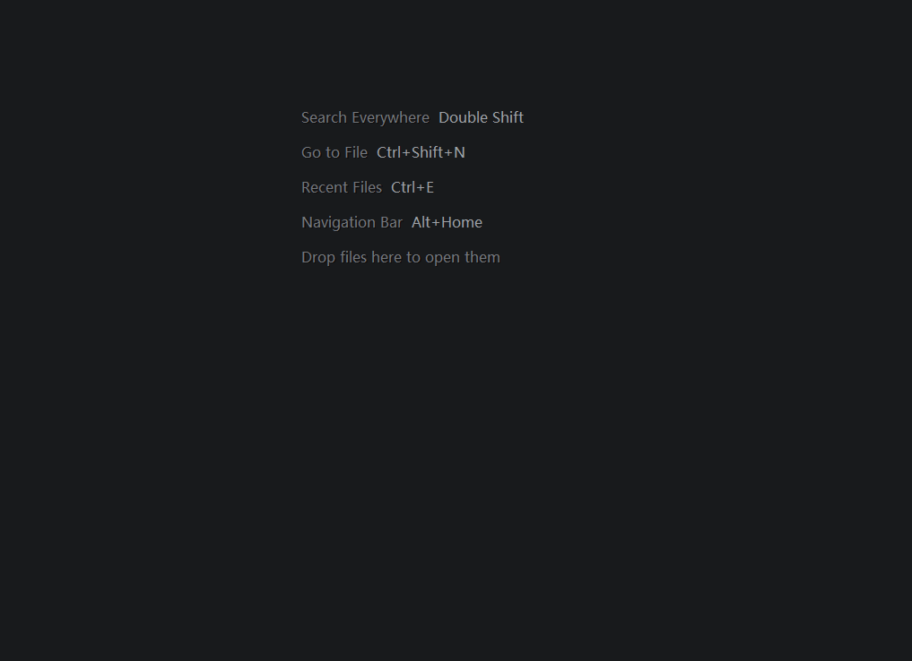
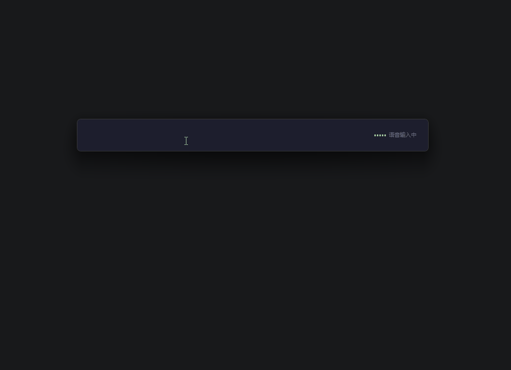
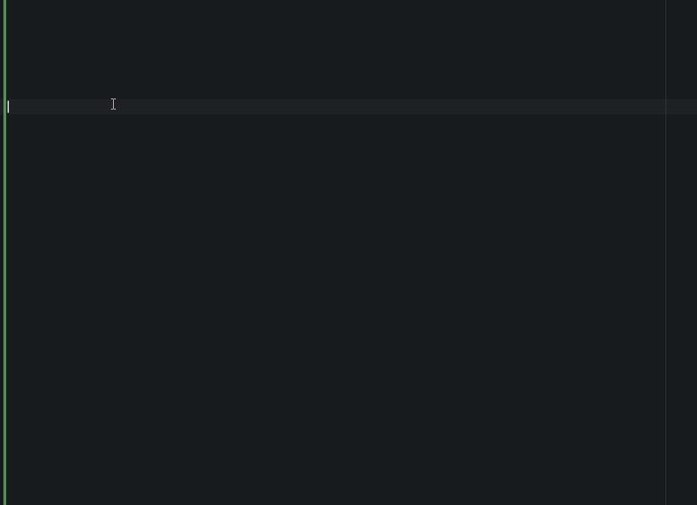
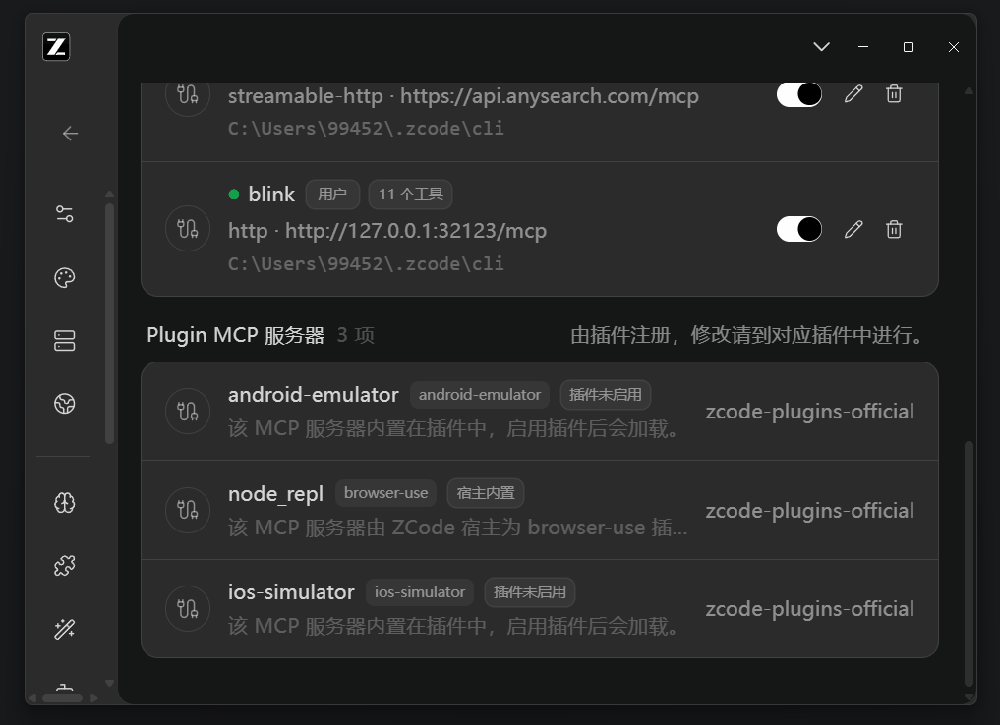

<h1 align="center">Blink</h1>

<p align="center">
  <strong>搜索只是开始。</strong>
</p>

<p align="center">
  Windows 丝滑启动器，让搜索、Chord、AI 与丰富的本地能力触手可及。
</p>

<p align="center">
  <a href="README_EN.md">English</a> · <a href="README.md">中文</a>
</p>

<p align="center">
  
  
  
  
</p>

<p align="center">
  
</p>

---

## 一个入口，完成更多操作

Blink 是一款 Windows 启动器，也是一套由 Chord 快捷动作、上下文感知和可组合能力构成的效率工具。

按下 `Alt + Space`，你可以搜索应用和文件，也可以直接处理眼前的内容：翻译选中文字、打开剪贴板链接、截图并 OCR，或通过 Chord 快速调用语音、便签和 AI。

这些功能并非彼此孤立。**截图、剪贴板、便签、OCR、翻译**和**插件**共享同一套能力底座，因此一个场景中的内容可以直接交给另一个能力继续处理，无需反复切换软件、保存文件或复制粘贴。

Blink 内置 AI 可以调用这些能力；经用户授权后，也可以通过 MCP Server 将它们提供给其他 Agent。

---

## 极速入口

<p align="center">
  
</p>

- **应用搜索** — 模糊匹配 + 拼音首字母 + 全拼（`wx` → 微信、`dksz` → 打开设置）
- **文件搜索** — 集成本地应用扫描、Everything 扩展
- **实时计算** — 计算公式回车即复制
- **剪贴板历史** — 后台记录，支持模糊搜索
- **Tab 快速采纳** — 输入 `fy` 按 Tab 自动补全为 `fanyi `，直接开始翻译
- **极速响应** — 唤起 < 50ms，首个结果 < 20ms

---

## 智能感知

<p align="center">
  
</p>

Blink 会在后台静默感知你的上下文，但不会打扰你——看到就用，看不到不碍事。

- **划词感知** — 在其他应用选中文本，唤起 Blink 后自动抓取，一键翻译或搜索（有些应用未实现 UIA 文本接口，划词可能无法感知，可手动 `Ctrl+C` 复制后唤起，Blink 会自动读取剪贴板内容）
- **剪贴板感知** — 复制了 URL？自动推荐打开链接。复制了英文？自动推荐通过插件翻译
- **Ghost Text 补全** — 输入 `fy`，灰色提示 `fanyi `，按 Tab 快速采纳，直接开始输入要翻译的内容
- **逐项可控** — 每种感知都可以在设置里单独关闭

---

## 插件生态

<p align="center">
  
</p>

插件运行在独立进程，崩溃不影响 Blink 核心。支持 Python、Node.js、Rust 或任何可执行文件。

- **翻译** — 多引擎内置
- **天气查询** — 简洁的天气卡片
- **IP 查询** — 快速查看当前网络信息
- **更多可能** — 用你熟悉的语言写插件，JSONL 协议通信，几行代码就能接入
- **未来** — 一键探索系统中的 CLI 工具，自动配置为 Blink 插件/skill

---

## Chord 增强

截图功能：
<p align="center">
  
</p>

AI 功能：
<p align="center">
  
</p>

语音输入：
<p align="center">
  
</p>

其他功能：
<p align="center">
  
</p>


主窗口打开时按住 Alt，字母键变成快捷动作入口。不用记全局快捷键，用的时候看一眼提示就行。

| 组合 | 作用                             |
|---|--------------------------------|
| `Alt + Q` | 唤起 AI 窗口进行对话                   |
| `Alt + A` | 区域截图 → 文本识别 / 翻译 / 钉图 / 复制/ 保存 |
| `Alt + C` | 剪贴板历史                          |
| `Alt + E` | 编辑当前内容；无上下文时打开空白编辑器           |
| `Alt + S` | 将当前内容创建为便签；无上下文时创建空白便签       |
| `Alt + Space` | 语音输入（支持在主窗口输入，也支持作为单独的语音输入法）   |
| `Alt + 1~9` | 快速触发结果列表中对应位置的项                |

截图后支持标注（矩形、箭头、文字、画笔、模糊、马赛克等）、OCR 文字识别、图上翻译、钉图置顶等。

按住 `Alt + Space` 可以语音输入，支持云端（OpenAI / Groq）和本地（FunASR）双引擎，边说边出字，VAD 自动切句。

---

## AI、Skill 与 MCP 就绪

能力调用：
<p align="center">
  
</p>

MCP Server：
<p align="center">
  
</p>


Blink 中可复用的业务能力可以被 AI 调用，也可以通过开放协议连接外部工具：

- **内置能力调用** — AI 可以调用搜索、应用、窗口、图片、剪贴板、便签等能力
- **插件调用** — 已安装插件会进入统一的 AI 工具池
- **Skill 支持** — 支持通过 `SKILL.md` 为 AI 注入工作流程与专业知识
- **MCP Client** — Blink 可以连接外部 MCP Server，在对话中使用外部工具
- **MCP Server** — Blink 也可以把用户选择的本地能力提供给其他 Agent
- **供应商支持** — 内置 OpenAI、DeepSeek 等预设，可配置任何兼容协议的供应商或本地大模型（Ollama / LM Studio）
- **对话窗口** — 独立 Agent 窗口，可以用自然语言组合并调用能力

---

## 路线图

**已完成：** 基础搜索 → 插件生态 → 上下文感知 → Chord 交互 → 语音输入 → 截图标注 → AI Agent → Skill 与 MCP 双向接入 → 便签、图片、剪贴板能力闭环

**持续演进：**

- **主链路可靠性** — 持续保护唤起、焦点、输入和首个结果速度
- **能力底座收敛** — 以 Capability 统一原子执行，持续交互留在 Interaction，并让本地、AI 与 MCP 在授权边界内复用同一实现
- **能力可发现性** — 让用户和 AI 更容易看到、理解并调用已有能力

---

## 安装

从 [Releases](../../releases) 下载最新安装包。

---

## 使用

1. 启动后 Blink 常驻系统托盘
2. `Alt + Space` 唤起输入框
3. 输入应用名（拼音首字母/全拼皆可）、算式、或插件触发词
4. `↑` `↓` 选择，`Enter` 或 `Alt + 1~9` 快速触发
5. 主窗口打开时按住 `Alt` 可以看到 Chord 快捷动作
6. `Esc` 或失焦隐藏

### 快捷键速查

| 操作 | 说明 |
|---|---|
| `Alt + Space` | 唤起 / 隐藏 |
| `↑` `↓` | 上下选择 |
| `Tab` | 采纳补全建议（如 `fy` → `fanyi `）或上下文推荐 |
| `Enter` | 启动 / 复制结果 |
| `Alt + Q` | AI 对话窗口 |
| `Alt + A` | 区域截图 |
| `Alt + C` | 剪贴板历史 |
| `Alt + E` | 编辑当前内容；无上下文时打开空白编辑器 |
| `Alt + S` | 将当前内容创建为便签；无上下文时创建空白便签 |
| `Alt + 1~9` | 快速触发对应位置的结果 |
| `Alt + Space`（按住） | 语音输入 |
| `Esc` | 隐藏 |

---

## 开发

### 环境要求

- [Rust](https://www.rust-lang.org/tools/install) 1.75+
- [Visual Studio Build Tools](https://visualstudio.microsoft.com/visual-cpp-build-tools/)（MSVC C++ 工作负载）
- [WebView2 Runtime](https://developer.microsoft.com/en-us/microsoft-edge/webview2/)（Windows 10/11 通常已预装）

### 构建运行

```bash
# 开发模式
cargo tauri dev

# 打包发布（含插件编译）
cargo xtask release

# 运行测试
cargo test --bin blink
```

### 架构概览

```
┌─────────────────────────────────────────────────────┐
│  Frontend (WebView2)                                │
│  纯 HTML/CSS/JS，无构建步骤                          │
└──────────────────────┬──────────────────────────────┘
                       │ invoke / event
┌──────────────────────┴──────────────────────────────┐
│  Tauri Commands Layer                               │
│  IPC 入口，连接前端与后端                              │
└──────────────────────┬──────────────────────────────┘
                       │
┌──────────────────────┴──────────────────────────────┐
│  Domain Layer (四域架构)                             │
│                                                     │
│  Awareness    ── 感知上下文（剪贴板/划词/前台应用）     │
│  Suggestion   ── 生产建议（Ghost Text / 智能推荐）     │
│  Routing      ── 路由决策（Query → 最佳动作）          │
│  Execution    ── 执行动作（统一入口，显式触发）         │
│                                                     │
│  SearchEngine ── 搜索引擎（应用/文件/计算器/剪贴板）   │
│  Capability   ── 能力层（截图/OCR/翻译/插件……）       │
│  AI Provider  ── AI 接口（rig-core，可切换供应商）     │
└──────────────────────┬──────────────────────────────┘
                       │
┌──────────────────────┴──────────────────────────────┐
│  Infrastructure Layer                               │
│  SQLite / Win32 API / 平台抽象 / 插件进程管理         │
└─────────────────────────────────────────────────────┘
```

### 想深入？

- [`docs/README.md`](docs/README.md) — 文档体系总览（产品愿景、里程碑、文档导航）
- [`docs/product.md`](docs/product.md) — 产品决策（为什么这么设计）
- [`docs/specs/`](docs/specs/) — 横切规范（怎么做·铁则）
- [`docs/phases/`](docs/phases/) — 各版本设计决策与踩坑记录

---

## 致谢

- [Wox](https://github.com/Wox-launcher/Wox) — Windows 上的先驱 Launcher
- [Alfred](https://www.alfredapp.com/) — 证明了全局输入框可以成为人机交互的第一入口
- [Raycast](https://www.raycast.com/) — 现代化 Launcher 体验，插件生态的标杆
- [Flow Launcher](https://www.flowlauncher.com/) — Windows 上的开源 Launcher，社区驱动的典范
- [uTools](https://u.tools/) — 国产效率工具，本地化体验的参考
- [Quicker](https://getquicker.net/) — 功能集大成者的灵感来源
- [Everything](https://www.voidtools.com/) — 极速文件搜索，Blink 文件搜索的集成方案
- [Ditto](https://github.com/sabrogden/Ditto) — 超好用的剪贴板管理工具
- [QuickLook](https://github.com/QL-Win/QuickLook) — 文件快捷预览
- [PixPin](https://pixpin.com/) — 我愿称为最强截图应用
 
---

## 许可

[MIT](LICENSE)
