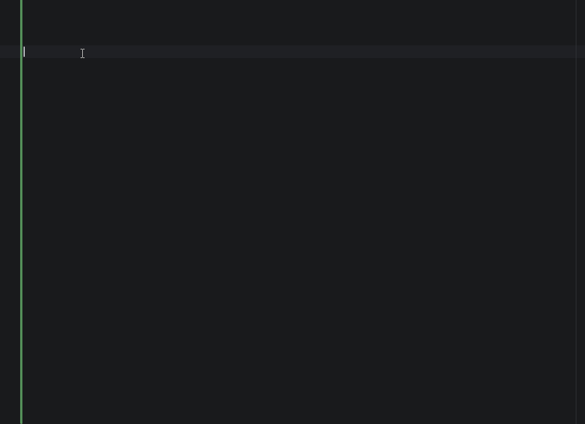

<h1 align="center">Blink</h1>

<p align="center">
  <strong>A smooth launcher for Windows — senses what you're doing, makes every action faster.</strong>
</p>

<p align="center">
  <a href="README_EN.md">English</a> · <a href="README.md">中文</a>
</p>

<p align="center">
  
  
  
  
</p>

<p align="center">
  
</p>

---

## More Than a Launcher

**Build an elegant, smooth launcher that seamlessly integrates common features, using Chord mode to invoke various enhanced capabilities — it's more than just a launcher.**

Blink transforms multi-step operations like "select English text → translate", "copy URL → open link", "screenshot → OCR extract text" into a single shortcut or one Tab press. The entire experience revolves around being **smooth** — fast summoning, fast response, short interaction paths.

With **Chord mode** (hold Alt + letter key while the main window is open), you can quickly invoke screenshot, translation, voice input and other enhanced capabilities without switching windows or memorizing complex shortcuts.

Under the hood, Blink is built on a **unified capability foundation**. Sticky notes, images, the clipboard, screenshots, OCR, translation, and more are no longer isolated features: the output of one capability can flow directly into another, without repeatedly saving files, switching apps, or copying and pasting.

These capabilities can be called by Blink's built-in AI or exposed through a local **MCP Server**. You decide which capabilities to expose, allowing other agents to use the search, plugin, window, image, and sticky-note capabilities running in your current Blink process.

---

## Capability Loops: Content Flows Naturally Between Capabilities

Blink's features are not isolated islands. The output of one capability can become the input of another:

- **Image Loop** — Screenshots, windows, and clipboard images can be annotated, processed with OCR, pinned, copied, or saved
- **Sticky Note Loop** — AI can create, read, update, and recycle sticky notes so temporary content remains actionable
- **Clipboard Loop** — Text and images can serve as context sources as well as inputs and outputs for other capabilities
- **AI Invocation** — Blink's built-in AI can combine these capabilities on demand to complete multi-step tasks
- **MCP Exposure** — Blink can run as a local MCP Server and make user-selected capabilities available to other agents

This is more than putting sticky notes, screenshots, and AI in the same app. They share the same capability semantics and live runtime state, reducing the cost of moving content between separate tools.

---

## Instant Search

<p align="center">
  
</p>

- **App Search** — Fuzzy matching + Pinyin initials + full Pinyin (`wx` → WeChat, `dksz` → Settings)
- **File Search** — Integrates local app scan and Everything extension
- **Live Calculator** — Calculation formulas, press Enter to copy
- **Clipboard History** — Background recording, supports fuzzy search
- **Tab Quick Accept** — Type `fy`, press Tab to auto-complete to `fanyi `, then start typing what you want to translate
- **Lightning Fast** — Summon < 50ms, first result < 20ms

---

## Context Awareness

<p align="center">
  
</p>

Blink silently senses your context in the background, but never intrudes — use it when you see it, forget it when you don't.

- **Selection Sensing** — Select text in any app, summon Blink to auto-capture it, one-key translate or search (a few apps don't expose UIA text interfaces, so selection may not be detected; in those cases, manually `Ctrl+C` to copy and Blink will read the clipboard content)
- **Clipboard Sensing** — Copied a URL? Auto-suggests "open link". Copied English text? Auto-suggests translation via plugins
- **Ghost Text Autocomplete** — Type `fy`, see gray hint `fanyi `, press Tab to accept quickly, then start typing your content
- **Per-item Control** — Each sensing type can be individually toggled in settings

---

## Plugin Ecosystem

<p align="center">
  
</p>

Plugins run in isolated processes — crashes don't affect Blink's core. Supports Python, Node.js, Rust, or any executable.

- **Translation** — Multi-engine built-in
- **Weather** — Clean weather card
- **IP Lookup** — Quick network info check
- **More Possibilities** — Write plugins in your favorite language, JSONL protocol communication, just a few lines of code to integrate
- **Coming Soon** — One-click discovery of CLI tools on your system, auto-configure them as Blink plugins/skills

---

## Chord Enhancements

Screenshot:
<p align="center">
  
</p>

AI:
<p align="center">
  
</p>

Voice input:
<p align="center">
  
</p>

Other capabilities:
<p align="center">
  
</p>


While the main window is open, hold Alt and letter keys become quick action shortcuts. No need to memorize global hotkeys — just glance at the hints when you need them.

| Combo | Action |
|---|---|
| `Alt + Q` | Open AI chat window for conversation |
| `Alt + A` | Region screenshot → OCR / translate / pin / copy / save |
| `Alt + C` | Clipboard history |
| `Alt + E` | Edit the current content; opens a blank editor when no context is available |
| `Alt + S` | Turn the current content into a sticky note; creates a blank note when no context is available |
| `Alt + Space` | Voice input (supports input in the main window or as a separate voice input method) |
| `Alt + 1~9` | Quick launch item by position in results |

Screenshots support annotation (rectangle, arrow, text, brush, blur, mosaic, etc.), OCR text recognition, on-image translation, and pin-to-top. Hold `Alt + Space` for voice input — supports cloud (OpenAI / Groq) and local (FunASR) dual engines, words appear as you speak with VAD auto-sentence-splitting.

---

## AI, Skills, and MCP Ready

Capability invocation:
<p align="center">
  
</p>

MCP Server:
<p align="center">
  
</p>

Blink's reusable capabilities can be called by AI and connected to external tools through open protocols:

- **Built-in Capabilities** — AI can invoke search, app, window, image, clipboard, sticky-note, and other capabilities
- **Plugin Invocation** — Installed plugins join the unified AI tool pool
- **Skill Support** — Use `SKILL.md` files to give AI specialized workflows and domain knowledge
- **MCP Client** — Blink can connect to external MCP Servers and use their tools in conversations
- **MCP Server** — Blink can also make user-selected local capabilities available to other agents
- **Multi-provider Support** — Includes presets for OpenAI, DeepSeek, and more, with support for compatible providers and local models such as Ollama and LM Studio
- **Chat Window** — A standalone agent window where natural language can be used to combine and invoke capabilities

---

## Roadmap

**Completed:** Core search → Plugin ecosystem → Context awareness → Chord interactions → Voice input → Screenshot annotation → AI Agent → Skills and bidirectional MCP integration → Sticky note, image, and clipboard capability loops

**Continuing Evolution:**

- **Core-path Reliability** — Continue protecting summon, focus, input, and first-result performance
- **Capability Foundation** — Let more existing capabilities share implementations and form more natural workflows
- **Capability Discoverability** — Make existing capabilities easier for both users and AI to find, understand, and invoke

---

## Installation

Download the latest installer from [Releases](../../releases).

---

## Usage

1. Blink sits in the system tray after launch
2. `Alt + Space` to summon the input bar
3. Type app name (Pinyin initials/full Pinyin supported), expression, or plugin trigger word
4. `↑` `↓` to select, `Enter` or `Alt + 1~9` for quick launch
5. While main window is open, hold `Alt` to see Chord quick actions
6. `Esc` or click outside to hide

### Keyboard Shortcuts

| Action | Description |
|---|---|
| `Alt + Space` | Summon / hide |
| `↑` `↓` | Navigate results |
| `Tab` | Accept completion suggestion (e.g. `fy` → `fanyi `) or context recommendation |
| `Enter` | Launch / copy result |
| `Alt + Q` | AI chat window |
| `Alt + A` | Region screenshot |
| `Alt + C` | Clipboard history |
| `Alt + E` | Edit the current content; opens a blank editor when no context is available |
| `Alt + S` | Turn the current content into a sticky note; creates a blank note when no context is available |
| `Alt + 1~9` | Quick launch by position |
| `Alt + Space` (hold) | Voice input |
| `Esc` | Hide |

---

## Development

### Prerequisites

- [Rust](https://www.rust-lang.org/tools/install) 1.75+
- [Visual Studio Build Tools](https://visualstudio.microsoft.com/visual-cpp-build-tools/) (MSVC C++ workload)
- [WebView2 Runtime](https://developer.microsoft.com/en-us/microsoft-edge/webview2/) (pre-installed on Windows 10/11)

### Build & Run

```bash
# Dev mode
cargo tauri dev

# Release build (includes plugin compilation)
cargo xtask release

# Run tests
cargo test --bin blink
```

### Architecture Overview

```
┌─────────────────────────────────────────────────────┐
│  Frontend (WebView2)                                │
│  Pure HTML/CSS/JS, no build step                    │
└──────────────────────┬──────────────────────────────┘
                       │ invoke / event
┌──────────────────────┴──────────────────────────────┐
│  Tauri Commands Layer                               │
│  IPC entry, connects frontend and backend           │
└──────────────────────┬──────────────────────────────┘
                       │
┌──────────────────────┴──────────────────────────────┐
│  Domain Layer (Four-domain Architecture)            │
│                                                     │
│  Awareness    ── Context sensing (clipboard/        │
│                 selection/foreground app)            │
│  Suggestion   ── Generate suggestions (Ghost Text   │
│                 / smart recommendations)             │
│  Routing      ── Route decisions (Query → best      │
│                 action)                             │
│  Execution    ── Execute actions (unified entry,    │
│                 explicit trigger)                    │
│                                                     │
│  SearchEngine ── Search engines (app/file/          │
│                 calculator/clipboard)                │
│  Capability   ── Capability layer (screenshot/OCR/  │
│                 translation/plugins...)              │
│  AI Provider  ── AI interface (rig-core, switchable │
│                 providers)                          │
└──────────────────────┬──────────────────────────────┘
                       │
┌──────────────────────┴──────────────────────────────┐
│  Infrastructure Layer                               │
│  SQLite / Win32 API / Platform abstraction /        │
│  Plugin process management                          │
└─────────────────────────────────────────────────────┘
```

### Want to dive deeper?

- [`docs/README.md`](docs/README.md) — Documentation hub (product vision, milestones, navigation)
- [`docs/product.md`](docs/product.md) — Product decisions (why it's designed this way)
- [`docs/specs/`](docs/specs/) — Cross-cutting specs (how · hard rules)
- [`docs/phases/`](docs/phases/) — Design decisions and pitfalls per version

---

## Special Thanks

- [Wox](https://github.com/Wox-launcher/Wox) — The pioneer launcher on Windows
- [Alfred](https://www.alfredapp.com/) — Proved that a global input box can be the first entry for human-computer interaction
- [Raycast](https://www.raycast.com/) — Modern launcher experience, gold standard for plugin ecosystems
- [Flow Launcher](https://www.flowlauncher.com/) — Open-source launcher on Windows, a model of community-driven development
- [uTools](https://u.tools/) — Homegrown efficiency tool, reference for localized experience
- [Quicker](https://getquicker.net/) — A feature-rich all-in-one, a source of inspiration
- [Everything](https://www.voidtools.com/) — Lightning-fast file search, Blink's file search integration
- [Ditto](https://github.com/sabrogden/Ditto) — A super handy clipboard management tool
- [QuickLook](https://github.com/QL-Win/QuickLook) — Quick file preview
- [PixPin](https://pixpin.com/) — I'd call it the most powerful screenshot app

---

## License

[MIT](LICENSE)
