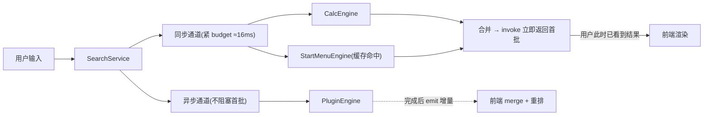
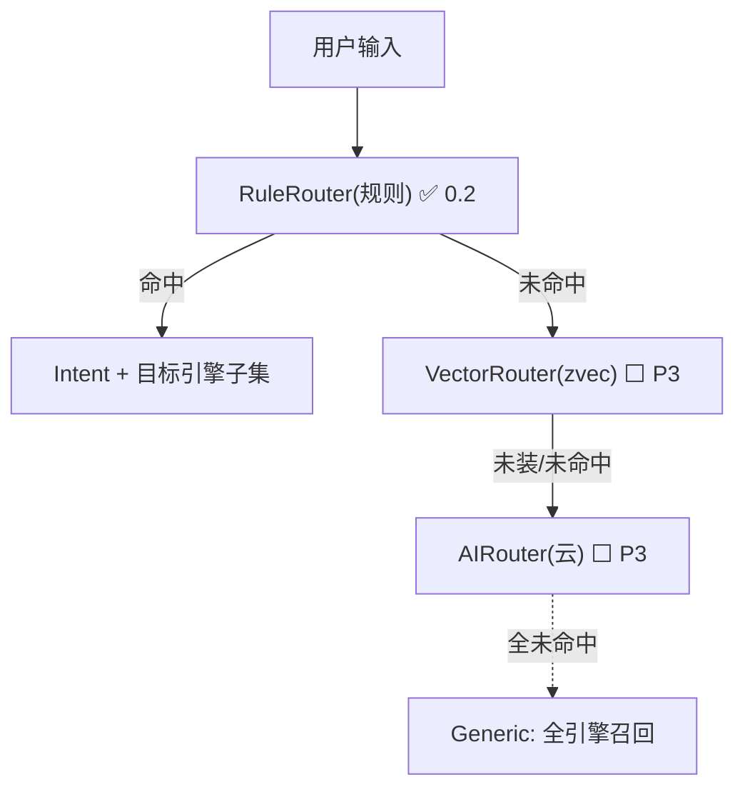

# Blink 0.2 — 核心与插件架构设计

> **定位**:为 0.2「核心服务化 + 多路搜索 + 插件系统」定义原理与协作机制。
> **性质**:概念设计文档,不写代码,只定架构。是阶段三实现的蓝图。
> **关系**:与 `00-overview.md`(产品/架构总纲)、`0.1-base.md`(0.1 总结)并列。本文对 MVP.md §12「评审待决策项」中**影响核心的条目逐条拍板**。

---

## 0. 目标与边界

### 0.1 本文档解决什么

多路搜索、插件加载、意图识别——这三者会**反向决定「核心」长什么样**:`SearchService` 要管多个引擎、插件要作为其中一路召回源、`IntentService` 要决定派发给谁。若核心骨架不定清楚就开始写搜索缓存,阶段三重构时大概率返工。

故本文在写任何 0.2 代码之前,先回答:

1. 核心服务骨架长什么样(§1)
2. 多路搜索如何组织、缓存归谁(§2)
3. 插件如何加载、如何接入搜索(§3)
4. 意图引擎如何参与路由(§4)
5. MVP.md §12 悬而未决项的结论(§5)
6. 哪些行为做成用户可配置(§6)
7. 产品体验与工程质量优化点(§7)

### 0.2 不解决什么(明确划出)

| 项 | 归属 | 理由 |
|---|---|---|
| 向量库 `zvec` / 语义检索 | P3 | §13.6 自身标注 SDK 极新,0.2 只留 trait 口子 |
| `tantivy` 去留(§12.13) | P1 评测 | 与本文核心无关,单列评估 |
| P4 语音触发键冲突(§12.14) | P4 | 本文不碰 |
| 进程级权限强制隔离 | 后续安全里程碑 | §3.6 说明,0.2 仅声明式 |
| AI 云模型对接 | P3 | §4 留 `AIRouter` trait |

### 0.3 与阶段二(0.1 收尾)的衔接

阶段二的三个收尾项按本设计落位,**保证不被阶段三推翻**:

- **搜索缓存** → 归属为「引擎内部数据」(§2.4),阶段二先在 `search` 模块写成内存索引,阶段三迁入 `StartMenuEngine` 时数据结构不变、只换所有者。
- **统一日志** → 引入 `tracing`(§1.6),每个 Service 自带 span,为插件进程日志聚合铺路。
- **开机自启 / 窗口定位** → 纯独立功能,与核心架构无关。

### 0.4 设计基调:从简,但边界/接口想清楚

0.2 的实现走「最简可用」路线,但**trait、协议、schema 必须预留扩展点**,避免阶段三/后续版本返工。具体表现:

- Service trait / SearchEngine trait / IntentRouter trait —— 0.2 只各实现一个具体类,但 trait 先定下来。
- 插件协议 —— 0.2 只用 query 文本,但消息类型、attachments、stream 字段先定义。
- manifest —— 0.2 只解析必要字段,但 schema_version / permissions / capabilities 先留。

> **配置化原则**(用户明确要求):遇到「可选行为」(默认值用户可能想改的),优先做成配置项 + 给合理默认,而非硬编码;但纯内部参数(如 fuzzy 算法权重、归一化细节)不暴露,避免配置项爆炸。详见 §6。

---

## 1. 核心服务骨架

### 1.1 现状与问题

当前 `main.rs` 在 `setup` 里直接线性编排:`init_db` → `init_config` → 注册热键 → `start_watchdog`。各模块是**静态函数 + `OnceLock` 全局状态**:

- `hotkey/mod.rs:39-45` —— `HOTKEY_CONFIG` / `SENDER` / `TAP_THRESHOLD` 三个全局
- `window/windows.rs:21-24` —— `STATE` / `START` / `INVOKE_AT` / `GRACE_MS` 四个全局
- `commands.rs` —— 直接调 `crate::search::...` / `crate::history::...`,编排逻辑混在 command 层

问题:

1. **生命周期分散**:无统一 start/stop,新增服务(插件/意图)时只能继续往 `main.rs` 塞。
2. **Window / Config 是裸函数**(MVP.md §12.17 已点名缺失)。
3. **全局静态耦合**:`OnceLock` 散落多模块,难测试、难替换。

### 1.2 Service trait

```rust
// 示意,非最终实现
#[async_trait::async_trait]
pub trait Service: Send + Sync {
    fn name(&self) -> &'static str;
    async fn start(&self, ctx: &AppContext) -> anyhow::Result<()>;
    async fn stop(&self) {} // 默认空实现,多数服务无需显式停止
}
```

**选型**:用 `async-trait` crate + `Box<dyn Service>`(成熟、支持 dyn 派发,注册表需要 dyn)。不采用 2024 原生 `async fn in trait`(对象安全受限,做 `dyn` 注册表需手动 `Pin<Box<dyn Future>>`,收益不抵复杂度)。

`AppContext` 是共享依赖容器(`SqlitePool`、`AppHandle`、`Config` 快照、`tracing` span),**不是** DI 容器——只是把现在散在 `app.state::<>()` 和全局静态里的依赖收拢显式化。

### 1.3 服务清单(0.2)

| 服务 | 现状映射 | 0.2 动作 | 依赖 |
|---|---|---|---|
| `ConfigService` | `config.rs` + history `config` 表 | 包成服务(补 §12.17) | Storage |
| `HistoryService` | `history.rs` | 包成服务 | Storage |
| `HotkeyService` | `hotkey::start` + 全局状态 | 包成服务 | Config |
| `WindowService` | `window::invoke/hide/watchdog` | 包成服务(补 §12.17) | — |
| `SearchService` | `commands::search_apps` 内联逻辑 | **新建(核心)** | History, Plugin, Intent |
| `PluginService` | 无 | **新建** | Config |
| `IntentService` | 无 | **新建(留接口)** | — |

### 1.4 通信模型(拍板 §12.15 / §12.5)

**核心决策:不引入通用 Event Bus 作为模块唯一通信方式。**

| 通信类型 | 走法 | 例子 |
|---|---|---|
| 请求-响应 | 直接 `async` 调用 / `mpsc` | search、launch、config 读写 |
| 通知(后端→前端) | Tauri `app.emit/listen`(**已有**,`blink://shown` 等) | 窗口显隐、**增量结果**(§2.3) |
| 通知(后端服务间) | `tokio::broadcast`,按需建,**不做全局 bus** | `PluginLoaded`、`VoiceFinished` |

### 1.5 服务注册与生命周期

服务按依赖拓扑启动(Config → History → 其余)。但注意:**引擎/路由表是运行时可变的**(插件动态装/卸),不能启动时写死——见 §3.7 动态注册表。`stop` 在应用退出时逆序调用,并 kill 所有插件子进程。

### 1.6 不要过度设计(边界)

**Service 只是「有统一 start/stop 生命周期 + 显式依赖」的模块,不是 actor,不跑在独立调度器上。**

- ❌ 不上 DI 容器、不上 actor 模型、不上全局 Event Bus 中介者
- ✅ Win32 hook 回调必须访问的全局状态保留 `OnceLock`,但收敛到单一 `HotkeyRuntime`,不再四散
- ✅ 统一日志用 `tracing`(每个 Service 自带 span),替换散落的 `eprintln`

---

## 2. 多路搜索架构

### 2.1 SearchEngine trait

```rust
#[async_trait::async_trait]
pub trait SearchEngine: Send + Sync {
    fn id(&self) -> &'static str;
    async fn search(&self, query: &str, ctx: &QueryContext) -> Vec<SearchItem>;
}
```

```rust
pub struct SearchItem {
    pub id: String,              // 去重键(如 lnk_path;calc 用表达式哈希)
    pub title: String,
    pub subtitle: Option<String>,
    pub icon: Option<Icon>,      // 阶段二图标
    pub score: f32,              // 引擎原始分,归一化到 0.0..=1.0
    pub action: SearchAction,    // Open(path) / Calc(copy) / Plugin(..) / Ai(..)
    pub source: &'static str,    // 产出该项的 engine id
}
```

### 2.2 引擎清单与分期

| 引擎 | 现状来源 | 0.2 状态 |
|---|---|---|
| `CalcEngine` | `calc.rs`(已稳) | ✅ 迁入 |
| `StartMenuEngine` | `search/windows.rs::scan_start_menu` | ✅ 迁入 + 缓存 |
| `PluginEngine` | 无(插件进程) | ✅ 接入(聚合多插件,见 §3.5) |
| `FileEngine` | 无 | ⬜ 留接口,不实现 |
| `VectorEngine`(zvec 语义) | 无 | ⬜ 留接口,P3 |

### 2.3 融合排序 + 渐进式(首结果优先)

> **修正点**:原设计的 `futures::join_all` 是 barrier(等所有引擎返回),插件超时会拖垮整次搜索,违背 CLAUDE.md「输入首个结果延迟 <20ms」。**改为 sync/async 双 lane。**

引擎按延迟分两条 lane:



- **invoke 同步返回首批**:只等 sync lane(本地引擎),紧 budget(约一帧 16ms)内出结果。
- **慢引擎增量推**:`PluginEngine` 完成后 `app.emit("blink://results", {seq, items})`,前端 merge。
- **seq 校验**:用户已输入下一个 query 时,旧 query 的增量直接丢弃。
- **意图路由是天然解药**(§4):多数输入命中本地引擎(`Calculate`/`OpenApp`),根本不查插件,用户零感知延迟。

**渐进式是 SearchService 的内建设计,不是接插件时才打的补丁**(用户明确要求)。§8 中 SearchService 从一开始就按 sync/async 双 lane 实现:0.2 的 async lane 暂由本地引擎填充(或留空),接插件时 PluginEngine 自然接入 async lane,无需「切换」。

### 2.4 缓存归属(拍板)

**缓存是引擎内部能力,不是 `SearchService` 或 `commands` 层的职责。**

| 引擎 | 缓存策略 |
|---|---|
| `StartMenuEngine` | 内存 `RwLock<Vec<AppEntry>>` + 启动后台预扫 + 目录 `mtime` 增量失效 |
| `CalcEngine` | 无状态,不缓存 |
| `PluginEngine` | 不缓存(实时查询插件进程) |

> **衔接阶段二**:阶段二先在 `search` 模块写「内存索引 + 启动预扫 + mtime 失效」最简缓存,阶段三 `StartMenuEngine` 成立后**数据结构完全复用,仅把所有者从模块全局换成引擎结构体字段**——零返工。

`SearchService` 只做「路由 + 并行召回 + 融合」,**不持有任何缓存**。

### 2.5 请求-响应与取消(拍板 §12.15)

search 是直接 `async` 调用,不走 bus。**取消靠 query 序号 + cancel 传播**:

- 前端每次输入带递增 `seq`(现有 `main.js` 已有 150ms debounce,后端再补 seq 校验双保险)。
- 后端返回前校验 `seq` 是否最新,过期结果丢弃。
- **cancel 传播到插件**(B2,§3.2 协议加 `cancel` 消息):query 被新 query 取代时,已在跑的插件查询收到 cancel(或被 kill),不占着插件进程。
- 引擎内部长查询用 `tokio::time::timeout` 兜底,不阻塞融合。

---

## 3. 插件系统

### 3.1 进程模型(语言无关)

**独立进程,任何能读 stdin、写 stdout 的程序都是插件。** core 只关心 stdio 协议,不在意对面语言:

| 插件形态 | manifest `runtime.exec` | core 怎么拉起 |
|---|---|---|
| Rust 编译的 exe | `./bin/plugin.exe` | 直接 spawn |
| Python 脚本 | `python ./main.py` | spawn 解释器 |
| Node/TS | `node ./index.js` | spawn node |
| Go exe / Shell | 同理 | spawn |

**协议(stdio JSON)是契约,SDK 是各语言便利封装。** 0.2:先定协议规范 + Rust 参考实现(自己写插件最快);Python/JS SDK 延后/社区,它们只是对 stdio JSON 的薄封装。

- **懒启动**:仅 query 命中 trigger 才拉起进程,常驻内存不被未用插件拖累。
- 通信走子进程 stdin/stdout,stderr 收集日志(汇入 `tracing`)。

### 3.2 通信协议(JSONL,扩展)

newline-delimited JSON(每行一个完整 JSON),可 `cat | jq` 调试。**消息类型**:

```jsonc
// core → 插件:查询
{ "id":"req_1", "type":"query", "query":"北京", "context":{"lang":"zh"},
  "attachments":[ /* 见下,可选 */ ] }

// core → 插件:取消(B2)
{ "id":"req_1", "type":"cancel" }

// 插件 → core:响应(可多行 = 流式)
{ "id":"req_1", "items":[ {"title":"本机 IP","value":"192.168.1.5","action":"copy"} ] }
```

**二进制 / 大块数据:引用(带外),不内联 base64。**

```jsonc
// 附件用引用(例:剪贴板图片传给插件)
"attachments":[
  { "type":"image",
    "ref":"file:///C:/Users/.../Temp/blink/clip-xxx.png",
    "mime":"image/png", "size":123456 }
]
```

- 附件默认走引用(零膨胀、支持大文件);仅很小的(<16KB 图标)可选 base64 内联。
- core 把图片写到专属临时目录 `%TEMP%/blink/`,JSON 只传路径,插件自读,用完即删(TTL 兜底)。
- **权限硬门槛**:读剪贴板、读临时文件都要 `permissions` 声明 + 用户首次确认(§3.6)。

**流式输出(AI token) = JSONL 多行:**

```jsonc
{"id":"req_1","items":[{"title":"回答","stream":true,"delta":"你好","done":false}]}
{"id":"req_1","items":[{"title":"回答","stream":true,"delta":",世界","done":false}]}
{"id":"req_1","items":[{"title":"回答","stream":true,"delta":"","done":true}]}
```

core 每收一行就 `emit` 增量——**和 §2.3 渐进式是同一个增量推送通道**。一套 JSONL 覆盖「普通查询 / 流式 AI / 增量结果」。

> **不上**长度前缀二进制帧(LSP 那种):99% 插件是文本交互,纯 JSONL 调试体验最好;二进制用引用已解决。高频低延迟流(P4 音频帧)留 `stream` capability 位,P4 再加专用 channel。

### 3.3 manifest

复用 MVP.md §8.1 schema,按 0.2 标注成熟度,并新增 `builtin` / `exclusive`:

| 字段 | 0.2 | 说明 |
|---|---|---|
| `schema_version` | ✅ 必填 | 兼容/migration 依据(见 §3.7) |
| `id` / `name` / `version` | ✅ 必填 | 唯一标识 |
| `builtin` | ✅ 新增 | `true` = 随 app 打包的核心插件,默认 enabled(见 §3.8) |
| `runtime.exec`/`type`/`protocol`/`timeout_ms`/`concurrency` | ✅ 必填 | 进程拉起参数 |
| `triggers` | ✅ 必填 | keyword/regex,intent 类型 0.2 解析但路由交 §4 |
| `triggers[].exclusive` | ✅ 新增 | keyword 命中是否独占路由,默认 `true`(见 §4.3) |
| `capabilities` | ✅ 必填 | `query` / `action` / `realtime` |
| `permissions` | ⚠️ 解析不强制 | 见 §3.6 |
| `resources` / `icon` / `homepage` 等 | ⬜ 留/展示 | P3 才用 / 设置页展示 |

### 3.4 生命周期


插件目录:`%APPDATA%\blink\plugins\<plugin-id>\`(第三方);builtin 随 app 安装目录、只读。

### 3.5 插件即召回源

`PluginService` 为所有 `capabilities: query` 的插件注册召回能力。**一个聚合 `PluginEngine`** 管多插件,对 `SearchService` 透明:

```rust
struct PluginEngine {
    plugins: RwLock<Vec<PluginHandle>>, // 每个 = 一个进程 + trigger 表
}
// search 时:按 query 命中哪些 trigger → 并行查询对应插件 → 合并
```

### 3.6 权限模型(自用阶段暂不实现)

**0.2 拍板:权限模型完全不实现。** 目前是自用产品,manifest 的 `permissions` 字段**不解析**,插件直接拥有完整能力(网络/文件/剪贴板)。

**未来(产品化/对外分发时)再做**:届时恢复「声明式 + 用户确认」(展示权限、首次启用确认),并视情况上进程级强制隔离(Job Object/AppContainer)。manifest schema 保留 `permissions` 字段,届时无需改 schema。

> 即:权限是「对外分发」的前置里程碑,自用阶段跳过,不阻塞核心+插件链路。

### 3.7 动态性、并发与兼容(架构硬伤修正)

插件是**运行时动态装/卸**的,以下必须支持,否则装不进去:

| # | 要求 | 设计 |
|---|---|---|
| **B1** | 引擎列表运行时可变 | `SearchService` 持 `RwLock<Vec<Arc<dyn SearchEngine>>>`;装/卸插件时增删并通知 |
| **B5** | 路由规则运行时可变 | `IntentService` 的 RuleRouter 规则表同样 `RwLock`;装插件时其 trigger 注入规则表 |
| **B3** | 全局插件并发上限 | 用户装 50 插件、一次 Generic 命中 10 个 trigger,不能全拉起。设全局进程池上限(可配置,见 §6),超出排队/丢弃 |
| **B2** | 取消传播 | 见 §2.5 / §3.2 `cancel` 消息 |
| **B4** | manifest 兼容策略 | `schema_version` 兼容窗口:core 声明支持的 `schema_version` 范围,超出范围拒绝加载并提示;不 silently break 老插件 |

热重载(改 manifest 不重启 core)是 B1/B5 的自然延伸,0.2 可不实现,但动态注册表是前提,已预留。

### 3.8 核心插件 builtin(默认开启)

| 类型 | 来源 | 默认 enabled | 权限确认 |
|---|---|---|---|
| builtin | 随 app 打包,只读 | ✅ 是 | 首次无需(已随 app 信任),可在设置禁用 |
| 第三方 | `%APPDATA%\blink\plugins\` | ❌ 否 | 首次启用需权限确认 |

- builtin 插件用 Rust 写(第一批 SDK 验证 + 自用,如 IP 查询、翻译壳)。
- manifest `builtin: true` 标记;加载时跳过用户目录扫描,从 app 资源目录加载。
- builtin 与第三方走**同一套协议/引擎接口**,无特权代码路径(只是默认 enabled + 信任来源不同)。

---

## 4. 意图引擎

### 4.1 路由模型(三级,0.2 只规则)



> §13.2:未装本地模型时,规则未命中直接降级云模型。0.2 既无向量也无 AI,故规则未命中 → `Generic`。

### 4.2 keyword 命中机制

manifest `triggers.keyword`,两种命中:

| 类型 | 条件 | 例子 |
|---|---|---|
| 精确 | query(归一化后)=== keyword | `ip` → IP 插件 |
| 前缀带参 | query 以 `keyword `(含空格)开头,余下为参数 | `weather 北京` → 天气插件,query=`北京` |

中文 keyword 支持首拼输入(见 §4.4)。

### 4.3 优先级:命中即独占

**精确/前缀 keyword 命中 → 只查该插件,不混应用搜索。**

理由:keyword 是用户**明确的意图信号**,独占 = 更简单、更快、更符合预期。给口子:trigger 声明 `exclusive`(默认 `true`),少数想和应用结果混排的设 `false`。

```
keyword 命中(exclusive) → 独占该插件,优先级最高
       ↓ 无命中
Generic → 全引擎召回(应用搜索为主,插件作补充)
```

### 4.4 匹配规则:与应用搜索「共享原语,策略各自」

| 层 | 内容 | 应用搜索 | 意图 keyword |
|---|---|---|---|
| **共享原语** | 文本归一化(拼音首字母、大小写、去空格)——抽到共享 `text` 模块 | ✅ | ✅ |
| **匹配策略** | 各自实现 | nucleo fuzzy(多结果按分排序) | 精确/前缀+分隔符(命中即路由) |

**复用点**:现有 `search/mod.rs:53 to_pinyin_initials` 提取到共享 `text` 模块,应用搜索和意图都调用。

**关键收益**:中文 keyword(如"天气")支持用户**首拼输入**(`tq`)命中——query 和 keyword 都过同一归一化。这是「共用」的真正价值。**不共用的是匹配策略本身**(fuzzy 是 recall 排序,keyword 是 trigger 判定,语义不同)。

### 4.5 IntentRouter trait + 0.2 边界

```rust
pub enum Intent { OpenApp, SearchFile, Calculate, Translate, Plugin, Ai, Generic }

#[async_trait::async_trait]
pub trait IntentRouter: Send + Sync {
    async fn route(&self, query: &str, ctx: &QueryContext) -> Intent;
}
```

| 实现 | 0.2 | 逻辑 |
|---|---|---|
| `RuleRouter` | ✅ 实现 | keyword(精确/前缀,§4.2)+ 简单 regex;规则表 `RwLock` 动态(B5);纯函数核心可单测(§7 B6) |
| `VectorRouter` | ⬜ trait 注入 | zvec 语义,P3 |
| `AIRouter` | ⬜ trait 注入 | 云模型兜底,P3 |

### 4.6 Intent → 引擎子集映射

| Intent | 派发引擎 |
|---|---|
| `Calculate` | CalcEngine 优先(命中即止) |
| `Plugin`/`Translate` | 命中 trigger 的插件(+ Translate 时 Ai) |
| `OpenApp` / `Generic` | StartMenuEngine + PluginEngine(全召回) |

---

## 5. 关键决策汇总(拍板 MVP.md §12)

| § | 开放问题 | 本文拍板 |
|---|---|---|
| 12.5 | Event Bus 可靠性 | 通知 `broadcast` / 可靠 `mpsc`;不搞全局唯一 bus |
| 12.8 | 数据层 migration | `sqlx::migrate`(已在 sqlx 生态),脚本放 `migrations/` |
| 12.10 | 最小权限清单 | P0:全局键盘钩子、文件读(开始菜单)、剪贴板(calc 复制);网络/选中文本/context 为 P2+ 放开 |
| 12.11 | 设置项定义 | `config.rs` 已覆盖核心;插件启用、AI Key 留字段(见 §6) |
| 12.15 | 请求响应 vs bus | 请求-响应直接调用/`mpsc`;bus 仅广播通知 |
| 12.16 | 插件权限强制 | **自用阶段不实现**(permissions 不解析);产品化时补声明式+确认 |
| 12.17 | Window/Config 服务 | 补为一等 `Service` |
| 12.18 | 内存目标 | 维持 `<300MB` |
| 12.19 | P0 验收 | `>99.9%`,非 1000/1000 |

不在本文范围:§12.2 焦点测试、§12.3 性能归属、§12.13 tantivy、§12.14 语音键冲突。

---

## 6. 配置化项清单

> **配置化原则**:可选行为(默认值用户可能想改的)优先做成配置项 + 给合理默认;纯内部参数不暴露。当前 `config.rs` 的 `AppConfig` 已有 hotkey/tap_threshold/grace_period/auto_start/language,0.2 扩展如下。

| 分类 | 配置项 | 默认 | 为什么配置化 |
|---|---|---|---|
| 搜索 | `search.empty_query_recents` | `true` | 空 query 是否显示历史常用(§7 A1)——有人喜欢干净 |
| 搜索 | `search.recents_count` | `5` | 空时显示几条——屏占比偏好 |
| 搜索 | `search.result_limit` | `10` | 结果上限 |
| 搜索 | `search.pinyin_enabled` | `true` | 拼音/首拼匹配开关——部分用户不需要 |
| 搜索 | `search.calc_enabled` | `true` | 是否显示计算结果 |
| 意图 | `intent.keyword_exclusive` | `true` | keyword 命中是否独占路由(§4.3) |
| 插件 | `plugin.global_concurrency` | `4` | 全局插件并发上限(§3.7 B3) |
| 插件 | `plugin.default_timeout_ms` | `3000` | 插件查询超时 |
| 插件 | `plugin.enabled` | `{}` | 各插件启用状态(builtin 默认 true) |
| 外观 | `ui.width` | `700` | 窗口宽度(顺带修硬编码 §window/windows.rs:124) |

> 不暴露:融合排序的历史加权系数、nucleo 匹配参数、归一化细节——纯内部,暴露徒增复杂度。

---

## 7. 产品体验与工程质量优化点

| # | 点 | 归属 | 说明 |
|---|---|---|---|
| **A1** | 空 query 显示历史常用 | 0.2(配置化) | 现在 `main.js:28` 空输入清空;改为按历史权重返回 top-N(`search.empty_query_recents`)。是 §13.8 Proactive Suggestion 雏形,低成本高体验 |
| **A2** | 插件失败降级 UX | 0.2 | 插件超时/崩溃用户看到什么?应静默不出现(或"插件 X 超时"小字)。插件系统没这个谈不上可靠 |
| **A3** | keydown 预热唤起 | 0.1 P0 优化 | §13.1:keydown 即异步预热窗口,keyup 确认 tap 后 focus。再压低唤起延迟,可后置 |
| **B6** | 测试性 | 0.2 | 融合排序、意图路由应纯函数化,脱离 Tauri 可单测。CLAUDE.md 说无测试套件,但这两块是产品逻辑核心,值得破例 |

---

## 8. 实施分期(子版本,小步迭代)

> 原则(用户要求):**版本边界别太大,一个个仔细来**。故把 0.2 拆成可独立验证的小里程碑。

| 子版本 | 内容 | 对应任务 | 验证标准 |
|---|---|---|---|
| **0.2.0** | 阶段二·0.1 收尾:搜索缓存、开机自启、tracing 日志、窗口定位、文档同步 | #2–#6 | 无架构改动;P0/P1 功能不变,首个结果延迟实测达标 |
| **0.2.1** | #7 Service 骨架:现有模块重构进 Service 框架 | #7 | **功能零变化**,只是结构化(重构后全部 P0/P1 行为不变) |
| **0.2.2** | #8 SearchService + 渐进式:SearchEngine trait + 引擎迁入 + 融合排序 + sync/async 双 lane(内建渐进式) | #8 | 多路搜索可用;渐进式首批即时返回 |
| **0.3+** | 插件(#9)、示例插件(#10)、意图引擎(#11) | #9–#11 | 插件链路 + keyword 路由 |

依赖:#7 → #8 →(#9 → #10/#11)。权限模型(§3.6)自用阶段全跳过。

---

## 9. 待确认取舍

1. ~~`async-trait` 依赖~~ → **已讲解并采用**(原理见对话:trait 里 async fn 不能直接做 `Box<dyn>`,crate 把它重写成返回 `Pin<Box<dyn Future + Send>>` 恢复 object-safe,代价是每次一次堆分配,可忽略)。
2. ~~权限模型~~ → **自用阶段不实现**(§3.6),产品化时补。
3. **版本边界** → 拆成 0.2.0 / 0.2.1 / 0.2.2 子版本(§8),0.3 做插件/意图。**待用户确认。**
4. ~~渐进式触发时机~~ → **改为 SearchService 内建设计**(§2.3),非接插件补丁。
