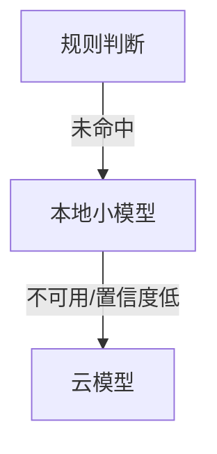
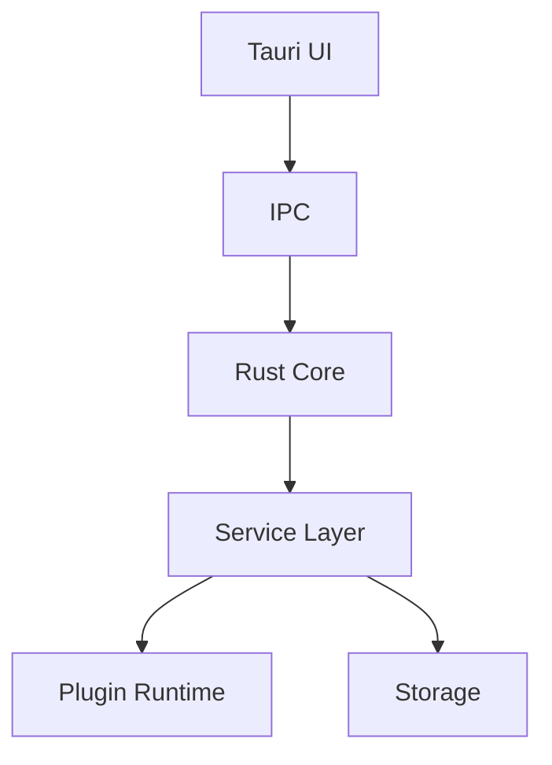
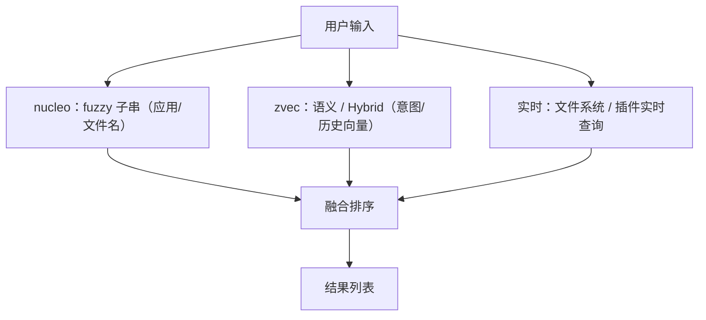
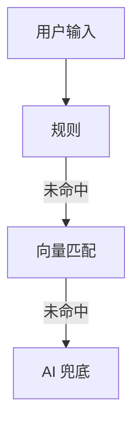
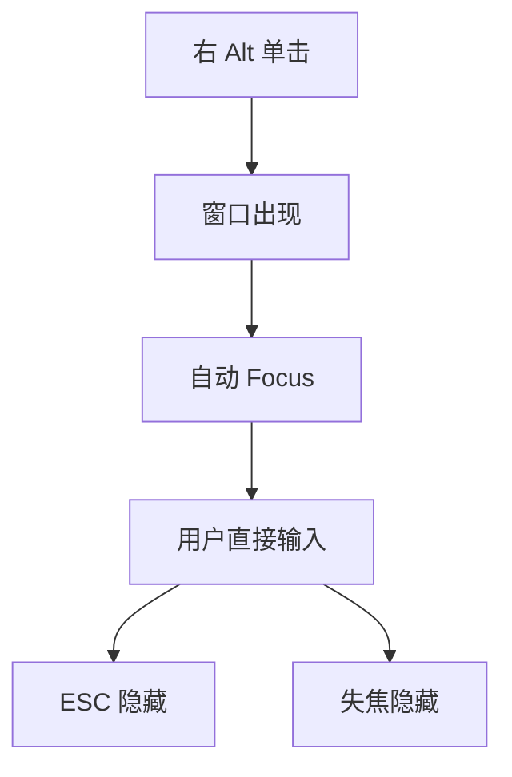

# Blink(暂定) — Windows Universal Launcher MVP

> **技术栈**：Rust + Tauri
> **定位**：Alfred / Raycast 风格的 Windows 全局快捷入口，但不止是启动器——是一个「Universal Action Layer（统一操作层）」。

---

## 1. 项目目标

### 1.1 核心原则

- 任何操作都应比原来的路径更快
- 极低延迟
- 全局可唤起
- 后续可扩展：插件 / AI / 语音 / Agent
- **MVP 优先验证基础交互的可靠性，而非功能数量**

### 1.2 目标性能

| 指标 | 目标 |
| --- | --- |
| 快捷键唤起延迟 | < 50 ms |
| 输入首个结果延迟 | < 20 ms |
| 常驻内存 | 100–200 MB |
| 输入焦点成功率 | > 99.9% |

> ⚠️ 见 §12.3：「首个结果 <20ms」依赖搜索能力，应归入 P1 而非 P0。

---

## 2. MVP 功能列表（按优先级）

### P0 — 基础能力验证

**目标**：验证「按快捷键 → 窗口弹出 → 用户直接输入」是否绝对可靠。

**功能**

- [ ] 全局快捷键（默认 右 Alt 单击唤起，见 §13.1；`Alt+Space` 作为备选）
- [ ] 悬浮窗口
- [ ] 输入框自动聚焦
- [ ] `ESC` 隐藏窗口
- [ ] 点击其他窗口时自动隐藏（失焦隐藏）
- [ ] 支持中文输入法（IME）
- [ ] 显示当前输入内容
- [ ] 调试信息面板：
  - 快捷键触发耗时
  - 窗口显示耗时
  - Focus 耗时
  - IME 初始化耗时
  - 触发成功率

**测试矩阵**

| 类别 | 场景 |
| --- | --- |
| 输入法 | 微软拼音、搜狗输入法、微信输入法 |
| 应用 | Chrome、VS Code、微信 |
| 环境 | 多显示器、高 DPI、全屏应用 |

**验收标准**

- 1000 次触发，成功率 `1000 / 1000`
- 失败统计：焦点丢失次数

> ⚠️ 见 §12.2：焦点可靠性需「自动化测耗时 + 人工测焦点」组合，纯自动化无法覆盖。

---

### P1 — 搜索能力

#### 应用搜索

- 搜索范围：已安装应用 / `exe` 程序
- 模糊匹配

| 输入 | 结果 |
| --- | --- |
| `wx` | 微信 |

#### 文件搜索

- 搜索范围：常用目录 / 最近文件
- 模糊匹配

#### 实时计算

- 本地计算，**不经过 AI**

| 输入 | 结果 |
| --- | --- |
| `1+1` | `2` |
| `100*0.25` | `25` |

#### 历史记录

- 记录：查询历史 / 执行动作历史
- 支持排序学习（按使用频率、时间调整结果排序）

---

### P2 — 插件系统

**目标**：支持扩展功能而不修改核心代码。

**内置 / 示例插件**：IP 查询、翻译、天气、GitHub、Notion、自定义脚本。

| 输入 | 输出 |
| --- | --- |
| `ip` | 本机 IP |
| `translate hello` | `你好` |

---

### P3 — AI 能力

#### AI 路由

按优先级逐级降级，**不要默认把所有输入都发给 AI**：



> 方向已定，见 §13.2：本地小模型作为可选重型插件，按需下载 / 启用，不启用则忽略。**未安装本地模型插件时，规则未命中直接降级到云模型（跳过中间级）。**

#### AI Provider 接口

```rust
trait AIProvider {
    // 支持实现：OpenAI / 本地模型 / 其他
    async fn completion(/* .. */);
    async fn embedding(/* .. */);
    async fn speech_to_text(/* .. */);
}
```

> 注：`speech_to_text` 为 P4 语音预留接口，P3 阶段可不实现。

---

### P4 — 语音

**功能**：长按快捷键（`Alt+Space` 长按）启动录音。


**建议方案**

- VAD：`silero-vad`
- STT：`whisper.cpp`

---

## 3. 技术架构

**原则**：UI 尽量薄，业务逻辑全部放 Rust。



### 模块结构

```
src/
├── core/        # runtime / eventbus / service
├── search/      # index / fuzzy / intent
├── plugin/      # runtime / sdk
├── ai/          # provider / local / remote
├── voice/       # vad / whisper
├── context/     # 环境感知层（CurrentUser Context），见 §13.7
├── storage/
└── ui/
```

---

## 4. 服务设计

定义统一服务接口（Rust 2024 edition 原生支持 `async fn` in trait）：

```rust
trait Service {
    async fn start(&mut self);
    async fn stop(&mut self);
}
```

**服务清单**

| 服务 | 职责 |
| --- | --- |
| `HotkeyService` | 全局快捷键监听与分发 |
| `SearchService` | 应用 / 文件 / 计算等检索 |
| `PluginService` | 插件进程管理与调用 |
| `IntentService` | 输入意图识别 |
| `AIService` | AI 路由与调用 |
| `ContextService` | 环境感知聚合，见 §13.7 |

---

## 5. Event Bus

**原则**：模块之间不直接调用，通过事件解耦。


- 实现：`tokio::sync::broadcast`

```rust
enum Event {
    QueryChanged(String),
    PluginLoaded,
    ResultUpdated,
    VoiceFinished,
    AICompleted,
}
```

> ⚠️ 见 §12.5：`broadcast` 在订阅者 lag 时会丢消息，需区分「通知型事件」与「需可靠处理的事件」（后者用 `mpsc`）。

---

## 6. 搜索架构

**多路召回 + 融合排序**（各路并行召回，统一打分后合并，非串行漏斗）：



**技术选型（分层）**

- Fuzzy 子串：`nucleo`（应用 / 文件名模糊，如 `wx` → 微信）
- 语义 / 向量 / Hybrid：`zvec`（见 §13.6）
- 全文索引：`tantivy`（待 P1 评估是否被 zvec FTS 覆盖，见 §12）

**数据结构**

```rust
struct SearchItem {
    id: String,
    title: String,
    keywords: Vec<String>,
    score: f32,
}
```

---

## 7. 意图识别

```rust
enum Intent {
    OpenApp,
    SearchFile,
    Calculate,
    Translate,
    Plugin,
    AI,
}
```



**优先级**：规则优先，AI 兜底。

- 向量匹配层使用 `zvec`（见 §13.6），并接收 §13.7 Context 快照增强判断（如「当前在浏览器选中英文 → 提升 `Translate` 意图权重」）。

---

## 8. 插件系统

**原则**：不加载 DLL，插件以独立进程运行（安全隔离）。

**目录结构**

```
plugin-ip/
plugin-weather/
plugin-github/
```

**通信协议**：`stdin` / `stdout`，JSON。

请求：

```json
{
  "type": "query",
  "query": "ip"
}
```

响应：

```json
{
  "items": [
    { "title": "Local IP", "value": "192.168.1.1" }
  ]
}
```

### 8.1 插件清单（manifest，初版）

每个插件根目录提供 `plugin.json`，core 启动时解析：

```json
{
  "schema_version": 1,
  "id": "plugin-weather",
  "name": "Weather",
  "version": "0.1.0",
  "author": "blink",
  "description": "查询天气",
  "icon": "icon.png",
  "homepage": "https://github.com/.../plugin-weather",

  "runtime": {
    "exec": "./bin/plugin-weather.exe",
    "type": "process",
    "protocol": "stdio-json",
    "timeout_ms": 3000,
    "concurrency": 4
  },

  "triggers": [
    { "type": "keyword", "value": "weather", "lang": ["en"] },
    { "type": "keyword", "value": "天气", "lang": ["zh"] },
    { "type": "regex", "value": "^(天气|weather)\\s+" },
    { "type": "intent", "value": "Weather", "weight": 0.8 }
  ],

  "permissions": [
    "network",
    "context.foreground_app",
    "context.selection"
  ],

  "resources": [
    { "type": "model", "name": "ggml-mini-q4", "size_mb": 480, "url": "https://...", "optional": true }
  ],

  "capabilities": ["query"]
}
```

**字段说明**

| 字段 | 说明 |
| --- | --- |
| `schema_version` | manifest 协议版本，core 据此做兼容 / migration |
| `runtime` | 执行方式：可执行路径、协议、单次查询超时、并发数 |
| `triggers` | 触发条件：关键词（按语言）/ 正则 / 意图声明（关联 §7 Intent + §13.6 向量匹配） |
| `permissions` | 最小权限声明：网络、context 字段订阅（关联 §13.7）、文件路径、剪贴板 |
| `resources` | 重型资源声明：模型下载（关联 §13.2 本地模型插件），`optional` 表示不启用可忽略 |
| `capabilities` | 插件能力：`query`（查询）/ `action`（执行动作）/ `realtime`（实时，如计算器） |

**生命周期**：core 启动 → 扫描插件目录 → 解析 manifest → 权限校验 → 懒启动（首次 query 时拉起进程）→ 超时 / 健康检查 → 退出清理。

---

## 9. 数据层

| 组件 | 选型 |
| --- | --- |
| 数据库 | SQLite |
| ORM | `sqlx` |
| 缓存 | `moka` |

**存储内容**（SQLite 仅存业务数据；用户配置见 §13.5 TOML，索引见 §6）

- 历史记录
- 插件信息（启用状态等元数据）
- AI 记录

> 搜索 / 向量索引由 `tantivy` / `zvec` 自管理（见 §6 / §13.6），不进 SQLite。

> ⚠️ 见 §12.8：缺 schema migration 策略（建议 `sqlx-cli migrate` 或 `refinery`）。

---

## 10. UI 建议

**MVP 阶段**：全部使用 Tauri（Web 渲染）。

**后期演进**：

| 场景 | 方案 | 原因 |
| --- | --- | --- |
| Launcher 窗口 | Rust + `egui` | 极快、高频刷新、极低内存 |
| 设置页 | Tauri | 富文本、插件市场、复杂布局 |

---

## 11. 注意事项（非常重要）

**不要优先开发**

- AI 聊天
- Agent
- 工作流
- 插件市场

**先验证这条主链路**——这是整个产品最重要的体验：



> 如果用户按快捷键后不能立即输入，其他所有功能都没有意义。

**优先验证**：用户能否无脑按快捷键并开始打字。
**而不是**：AI 能力有多强。

---

## 12. 评审待决策项（开放问题）

> 仍需逐项拍板的事项。涉及快捷键、本地模型、签名的方向已确认，见 §13。

- **12.2 P0 焦点测试方法**：「1000/1000」需明确手段——自动化脚本测耗时 + 人工按测试矩阵测焦点，两者结合。纯自动化无法复现真实焦点行为。
- **12.3 性能指标归属**：「首个结果 <20ms」依赖搜索能力，建议从 §1.2 移至 P1 验收。
- **12.5 Event Bus 可靠性**：`broadcast` 在 lag 时丢消息。建议区分「通知型事件」（broadcast）与「需可靠处理的事件」（mpsc channel，如 QueryHistory）。
- **12.8 数据层 migration**：补充 schema 迁移方案（`sqlx-cli migrate` / `refinery`）。
- **12.10 最小权限清单**：需列出 P0 所需最小权限（全局键盘钩子、文件读取、网络），并明确 P2+ 才放开的权限。
- **12.11 设置项定义**：「用户设置」需细化（快捷键、搜索路径、启用插件、AI Provider Key 等）。
- **12.12 计算器范围**：明确支持的表达式范围（四则 + 括号 + 百分比），或直接采用 `evalexpr` / `meval` 等成熟 crate，避免 `(1+2)*3` 无响应。
- **12.13 tantivy 去留**：zvec FTS 是否足以覆盖全文索引需求，待 P1 评测；若覆盖则移除 tantivy、与 zvec 合并以减少依赖，否则两者并存。
- **12.14 P4 语音触发键冲突**：§P4「长按 `Alt+Space` 录音」与 §13.1 右 Alt tap/hold 冲突（hold 已定义给系统 Alt）。需重新设计语音触发（另选键 / 唤起后长按空格 / 双击等）。
- **12.15 Event Bus 通信模型**：§5 将 event bus 作为模块唯一通信方式偏教条；输入→搜索属强请求-响应，走 `broadcast` 会引入竞态（快速输入时旧结果覆盖新结果）与 cancellation 难题。建议：请求-响应走直接调用 / `mpsc`，event bus 仅用于广播通知（`PluginLoaded` / `VoiceFinished`）。
- **12.16 插件权限强制**：§8.1 `permissions` 当前为声明，独立进程不受其约束（声明 `network:false` 的插件仍可联网）。需补强制机制（进程级网络 / 文件限制，或 capability token）。
- **12.17 P0 窗口/焦点服务缺失**：§4 服务清单无 `WindowService`（窗口显隐 / 聚焦 / IME 协调）与 `ConfigService`，而 P0 核心体验正是窗口与焦点。建议补齐为一等公民。
- **12.18 内存目标校准**：§1.2「常驻 <100–200MB」与 Tauri + WebView2 基线（约 80–150MB 起步）冲突。建议放宽（如 <300MB），或 MVP 即评估 `egui`（见 §10，但换框架需重验 P0 焦点）。
- **12.19 P0 验收标准**：「1000/1000 = 100%」不现实，真实系统存在偶发失败（系统负载、其他应用抢焦点）。建议改为「成功率 >99.9%」或「连续 N 次无焦点丢失」。

---

## 13. 已确认的技术方案与选型

> 以下方向经讨论确认，作为既定方案落地。

### 13.1 默认快捷键：右 Alt（tap 唤起 / hold 系统组合）

采用 **低级键盘钩子（`WH_KEYBOARD_LL`）+ tap/hold 延迟判定**，实现「单击右 Alt 唤起、按住右 Alt 配合其他键时仍作系统 Alt」：

- 钩子里**不在 keydown 时吞掉右 Alt**，始终 `CallNextHookEx` 放行给系统；
- 记录右 Alt 按下时刻；若在释放前出现任何其他键 → 判定为组合键，整段放行（`右Alt+X` 系统组合完全不受影响）；
- 若右 Alt 被单独按下并松开、期间无其他键 → 判定为 tap → 触发唤起；
- 感知延迟优化：keydown 时即异步预热窗口（加载 / 置顶），keyup 确认 tap 后立即 focus + 显示，唤起延迟可压到接近 0。

> 关键区别：做得差的产品在 keydown 就 `return 1` 吞掉右 Alt（独占），导致右 Alt 无法再作系统修饰键；本方案全程不吞，系统组合不受影响。

- 实现：`windows` crate（`SetWindowsHookExW`）。Tauri 官方 `global-hotkey` 基于 `RegisterHotKey`，**不支持 tap/hold**，需自行编写 LL hook。
- 坑：LL hook 回调必须极快（否则被 Windows 强制摘除），回调内只更新状态机，实际处理交主线程；全局键盘钩子是键盘记录器典型特征，杀软敏感（见 §13.3）。

### 13.2 本地小模型：作为可选重型插件

本地生成 / 对话模型内存占用大，不进 core；作为**重型插件**，按需下载、显式启用，不启用则完全忽略，core 常驻内存不受影响：

- 复用 §8 插件进程隔离机制，模型崩溃不影响 launcher；
- 推理栈：`llama.cpp`（`llama-cpp-rs`）/ `whisper.cpp`（`whisper-rs`），走 GGUF / ONNX 量化模型；
- 在 P3 的 AI Provider 接口中，本地实现由该插件提供，core 只依赖 `AIProvider` trait。模型文件通过 §8.1 manifest 的 `resources` 字段声明下载。

### 13.3 代码签名：开发期可忽略，分发前必做

- **开发期**：可不签名，本地运行 / 内测无碍；但需预判「全局键盘钩子 + 未签名」会被 Defender / 第三方杀软盯上（拦截、弹窗甚至删文件），建议把项目目录加入 Defender 排除列表。
- **分发期**：必须签名（OV / EV 证书），否则 SmartScreen 拦截、杀软误报，对该类常驻 + 全局热键应用是致命的。
- 签名作为「对外分发」前置里程碑，证书采购可晚于 MVP。

### 13.4 i18n：MVP 最小化，架构留口子

- **UI 文案**：MVP 中文硬编码，但统一走 i18n key（Rust 端 `fluent` / `rust-i18n`，或前端 i18n 库），后期补英文。
- **Intent 触发关键词**：必须支持多语言（中文用户期望 `翻译` / `查IP`，英文用户期望 `translate` / `ip`），规则表按语言配置。
- **本地化格式**：日期 / 数字 / 计算结果按 locale 格式化。

### 13.5 配置持久化：配置文件 + 数据库 + 密钥加密

分层存储，避免「全塞 SQLite」或「全塞 JSON」：

| 类型 | 存储 | 说明 |
| --- | --- | --- |
| 用户配置（快捷键、搜索路径、启用插件、UI 偏好、语言） | TOML 文件（`%APPDATA%\blink\config.toml`） | 人类可读、可手编、支持热更新 |
| 业务数据（历史记录、搜索索引、AI 记录、插件信息） | SQLite（`sqlx`） | 结构化、可查询 |
| 敏感凭证（AI Provider Key） | Windows Credential Manager / DPAPI | 不落明文 |

- 配置 schema 版本化（配合 §12.8 migration）；
- 配置热更新：改快捷键 / 启用插件无需重启。

### 13.6 向量 / Embedding 选型（支撑意图识别第 2 级与语义检索）

采用 **`zvec`**（阿里巴巴开源，进程内嵌入式向量数据库，「向量界的 SQLite」）作为向量 / 语义检索引擎，替代自研内存暴力 cosine。

**选型依据**

| 维度 | zvec |
| --- | --- |
| 形态 | 进程内嵌入式，无服务器 / 零配置，契合「常驻 <200MB」 |
| Rust 集成 | 官方 `zvec` crate（crates.io，MSRV 1.75，bundled 零配置安装） |
| 平台 | Linux / macOS / **Windows x86_64** |
| 检索能力 | Dense + Sparse 向量、**Hybrid 检索**（向量 + FTS + 标量过滤单查询）、DiskANN |
| 持久化 | WAL，进程崩溃 / 断电不丢 |
| 协议 | Apache-2.0 |

**核心收益是 Hybrid 检索**：launcher 可在单次查询中融合「应用名 / 关键词（稀疏 + FTS）」与「意图语义（dense 向量）」，正好对应 P1 搜索 + §7 意图识别的混合需求。

**分层职责（关键：zvec 不替代 fuzzy 子串匹配）**

| 层 | 引擎 | 职责 | 说明 |
| --- | --- | --- | --- |
| Fuzzy 子串 | `nucleo` | 应用 / 文件名模糊（`wx` → 微信） | zvec FTS 不擅长缩写 / 子串模糊，这是 P1 核心，保留 nucleo |
| 语义 / 向量 | `zvec` | 意图向量、历史 query 向量、语义文件搜索、Hybrid | 新增 |
| Embedding 生成 | `fastembed` | 文本 → 向量，喂给 zvec | zvec 只管存储检索，不管生成 |
| 全文索引 | `tantivy` | 待 P1 评估是否被 zvec FTS 覆盖 | 转 §12 |

**风险与对策**

- **Rust SDK 极新**：v0.5.0（2026-06-12）才提供官方 Rust SDK，需跟踪稳定性；MVP 试用，关键路径保留「可切回内存 `Vec<Vec<f32>>` + 暴力 cosine」的抽象。
- **FFI 依赖**：底层为 Proxima 引擎（C++），`zvec-bindings` 为 FFI 绑定，Windows 构建需 MSVC 工具链；bundled 安装模式可缓解。
- **与 §13.2 复用**：embedding 模型（轻）与本地生成模型（重）同属「本地推理运行时」，按需启用；未启用时第 2 级直接跳过（规则 → AI）。

### 13.7 Context 层（环境感知，CurrentUser Context）

**定位**：系统级「环境感知层」。让 launcher 从被动启动器（输入 → 执行）升级为智能操作入口（自动感知上下文 → 智能动作）。对应 §3 `context/` 模块与 §4 `ContextService`。

**感知维度**

| 维度 | 含义 | 采集方式（Windows） |
| --- | --- | --- |
| 前台应用 | 用户当前在哪个应用 / 看什么 | `GetForegroundWindow` + 进程名 / 窗口标题 |
| 选中文本 | 用户选中了什么 | UI Automation（UIA）/ 可访问性 API |
| 活跃上下文 | 当前页面 URL / 编辑器文件 | 浏览器扩展 / 编辑器插件（native messaging） |
| 剪贴板 | 最近复制内容 | Clipboard API |
| 系统状态 | 时间、网络、电源等 | 系统 API |

**设计要点**

- **低频采集 + 按需快照**：不每次按键采集，维护「最近一次有效 context」；唤起时取快照，兼顾性能与隐私。
- **暴露给消费者**：`IntentService`（上下文辅助意图识别）、`AIService`（上下文增强 prompt）、插件（提供 context-aware 动作）。
- **按权限下发**：插件按 `permissions` 声明订阅 context 字段（关联 §8.1），未授权字段不下发。

**隐私（重点：context = 读取屏幕内容，权限极高）**

- 默认全本地，选中文本 / URL 等敏感字段**绝不默认发往云端**；发 AI 前需用户开关 + 脱敏。
- 应用黑 / 白名单：敏感应用（银行、密码管理器）默认关闭感知。
- 敏感内容不持久化（不入 SQLite），仅驻留内存快照。

### 13.8 主动建议（Proactive Suggestion，P3+ 演进）

Context 层从「感知」走向「主动」：基于快照预测用户下一步并**直接把动作推到面前**，零输入即可执行——这是从 Alfred 跃迁到智能操作入口的关键一跳。

| Context 快照 | 主动建议动作 |
| --- | --- |
| 选中英文文本 + 浏览器在前台 | 翻译 / 总结 |
| 选中代码 | 解释 / 重构 / 查文档 |
| 剪贴板是报错日志 | 分析原因 / 搜解决方案 |
| 终端前台且输入框空 | 最近命令 / 补全 |
| 复制了文件路径 | 打开 / 在资源管理器定位 |

**设计要点**

- 唤起时由 `ContextService` + `IntentService` 联合产出「Top-N 建议」，作为结果的零号位（无需输入即可选中回车）。
- 建议来源可配置、可学习（基于历史采纳率调整），默认克制，避免打扰。
- 隐私同 §13.7：敏感 context 字段参与本地规则建议，发云需开关。
